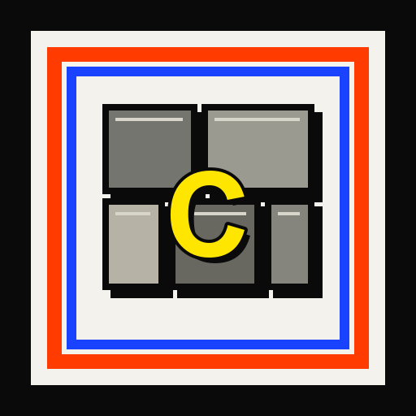
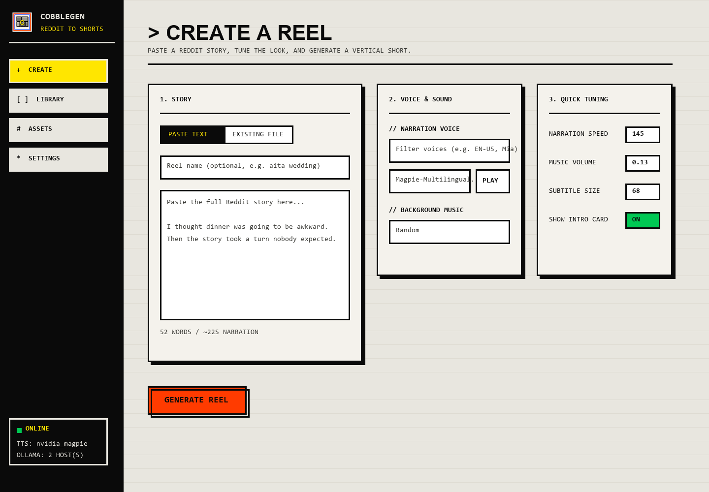
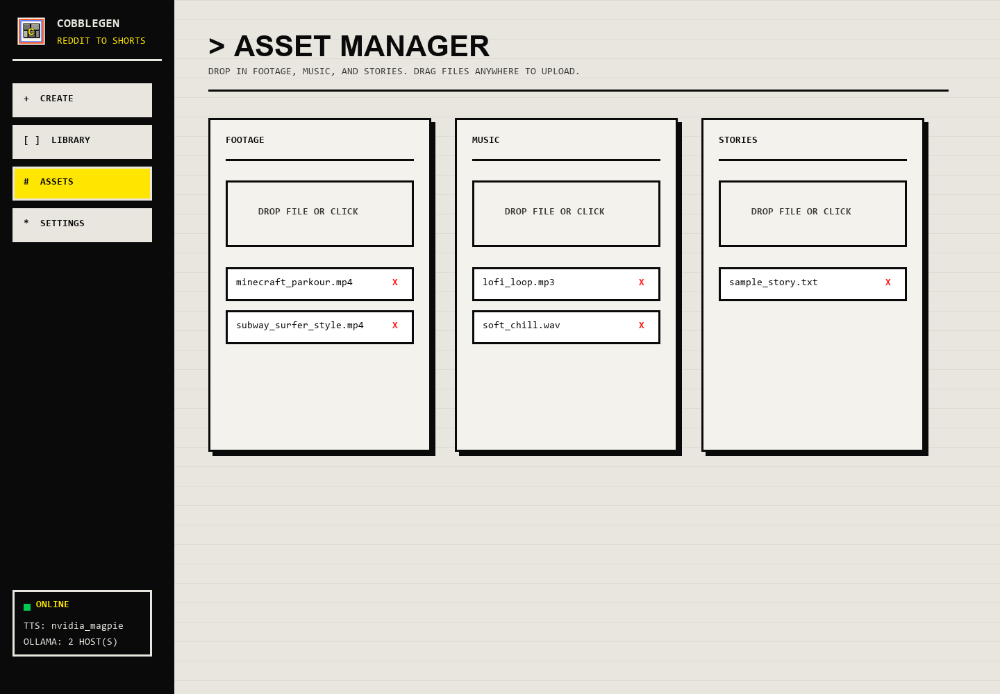

<p align="center">
  
</p>

# CobbleGen


CobbleGen turns Reddit-style story text into vertical short-form reels. It ships with a FastAPI web studio for pasting stories, choosing narration voices, uploading gameplay footage and music, watching live generation progress, and browsing finished reels with copy-ready metadata.

The repository intentionally does not include private stories, rendered output videos, temporary files, voice previews, footage, music, `.env`, or local pipeline state. Drop your own assets into the folders after cloning.

## Preview





## Features

- Browser studio for story input, asset uploads, voice preview, settings, job progress, and reel library
- CLI pipeline for one story or batch processing a `stories/` folder
- Ollama story analysis with host failover and per-host model selection
- NVIDIA Magpie/Riva narration with emotional voice variants and chunk stitching
- Edge TTS fallback for simpler local runs
- Karaoke-style ASS subtitles burned into the final video
- Optional Unsplash scene images and captions
- Drag-and-drop background footage and music
- FFmpeg rendering with NVENC preference when available

## Requirements

- Python 3.11 or newer
- FFmpeg and FFprobe available on `PATH`
- Ollama, either on your PC or reachable on another host
- At least one vertical-compatible background video in `footage/`
- Optional music files in `music/`
- For NVIDIA narration: an NVIDIA API key with Riva/Magpie access
- Optional Unsplash API key for contextual scene images

Install Ollama from <https://ollama.com/> and pull or expose the model you want to use. Cloud-backed Ollama models work too as long as your configured Ollama host serves them.

## Setup

```bash
git clone https://github.com/Dr4cule/CobbleGen.git
cd CobbleGen

python -m venv .venv
# Windows PowerShell:
.venv\Scripts\Activate.ps1
# macOS/Linux:
# source .venv/bin/activate

pip install -r requirements.txt
cp .env.example .env
```

Then edit `.env`.

For a single local Ollama instance:

```env
OLLAMA_BASE_URL=http://localhost:11434
OLLAMA_MODEL=nemotron-3-super:cloud
```

For a master/slave setup or multiple remote Ollama hosts:

```env
OLLAMA_HOSTS=http://master:11434|nemotron-3-super:cloud,http://slave:11434|qwen3.6:27b
```

Each `OLLAMA_HOSTS` entry uses `url|model`. CobbleGen tries them in order and falls back automatically if one host is unavailable. If `OLLAMA_HOSTS` is not set, it uses `OLLAMA_BASE_URL` plus a default `slave` fallback.

For NVIDIA Magpie narration:

```env
TTS_BACKEND=nvidia_magpie
NVIDIA_API_KEY=your_key_here
NVIDIA_TTS_VOICE=Magpie-Multilingual.EN-US.Mia
```

For a lighter fallback:

```env
TTS_BACKEND=edge_tts
TTS_VOICE=en-US-GuyNeural
```

## Add Assets

Place your own files here:

```text
footage/   gameplay or background videos, such as .mp4 or .mov
music/     optional background tracks, such as .mp3 or .wav
stories/   optional .txt story files for CLI or existing-file web runs
```

These folders are ignored by Git except for `.gitkeep`, so your private assets and generated media stay local.

## Run The Web Studio

```bash
python -m webapp.run
```

Open `http://127.0.0.1:8000`.

Useful variants:

```bash
python -m webapp.run --port 9000
python -m webapp.run --host 0.0.0.0 --port 8000
```

## Run From The CLI

Process one story:

```bash
python main.py --story stories/my_story.txt
```

Process every unprocessed `.txt` file in `stories/`:

```bash
python main.py --all
```

Force reprocessing:

```bash
python main.py --story stories/my_story.txt --reprocess
```

List voices for the configured TTS backend:

```bash
python main.py --list-voices
```

Reset local processing history:

```bash
python main.py --reset-footage
python main.py --reset-stories
```

## Output

Finished reels and metadata are written to `output/`:

```text
output/
  story_stem_safe_title.mp4
  story_stem_safe_title_meta.txt
```

The metadata file includes the title, description, hashtags, hook, intro/outro text, source story, selected footage, music, photo credits, and final video path.

## Project Layout

```text
CobbleGen/
  main.py                 CLI entrypoint and progress events
  config.py               .env loading and typed settings
  modules/                story, TTS, subtitles, images, video, state
  webapp/                 FastAPI studio
    run.py                local web server launcher
    server.py             API routes
    jobs.py               background job manager
    static/               UI, logo, favicon assets
  docs/screenshots/       README preview screenshots
  footage/                local user videos, ignored
  music/                  local user music, ignored
  stories/                local story text, ignored
  output/                 generated reels, ignored
  temp/                   render workspace, ignored
```

## Troubleshooting

If Ollama fails, confirm the configured host is reachable and has the model:

```bash
curl http://localhost:11434/api/tags
curl http://master:11434/api/tags
```

If NVIDIA voice listing or generation fails, check `NVIDIA_API_KEY`, network access to `grpc.nvcf.nvidia.com:443`, and:

```bash
python main.py --list-voices
```

If no video is produced, confirm FFmpeg/FFprobe are installed, `footage/` contains at least one supported video file, the story is not empty, and your TTS backend can generate audio.

If GPU rendering fails, set:

```env
VIDEO_RENDER_PREFER_GPU=false
VIDEO_CODEC=libx264
```
